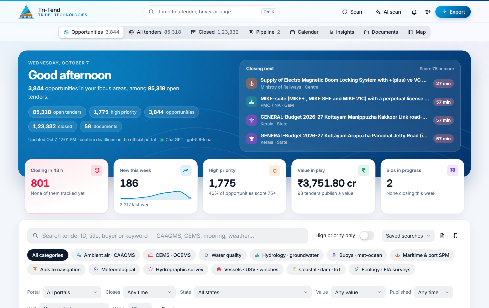
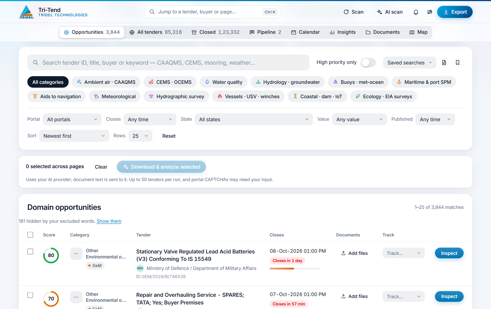
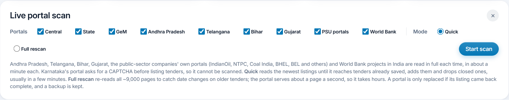
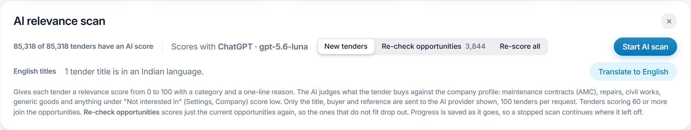
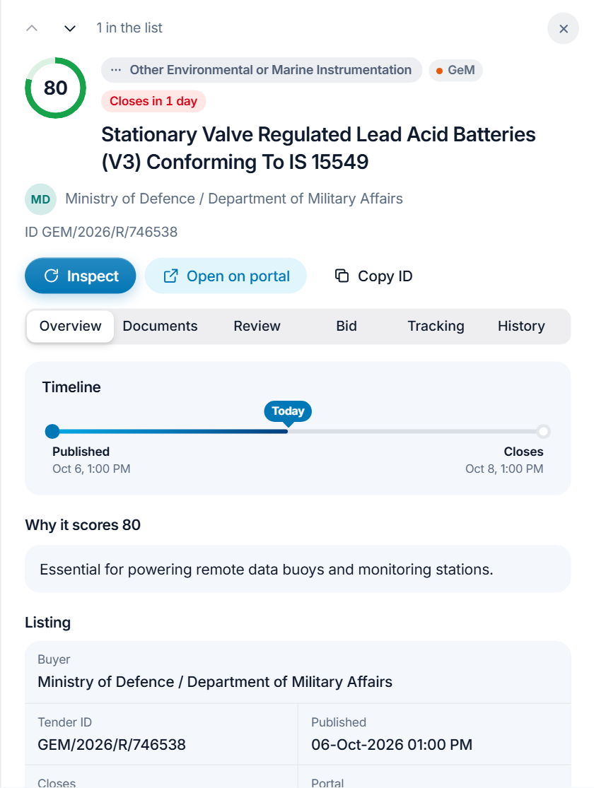
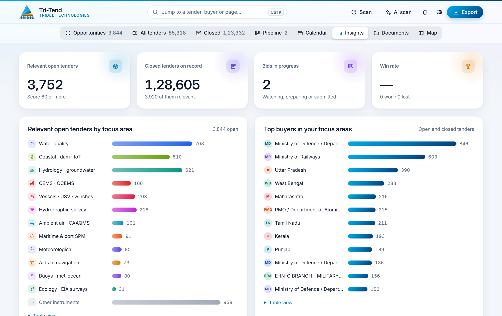
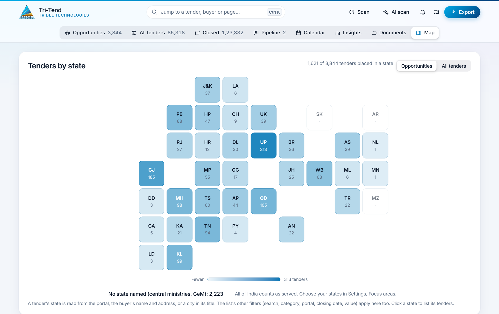
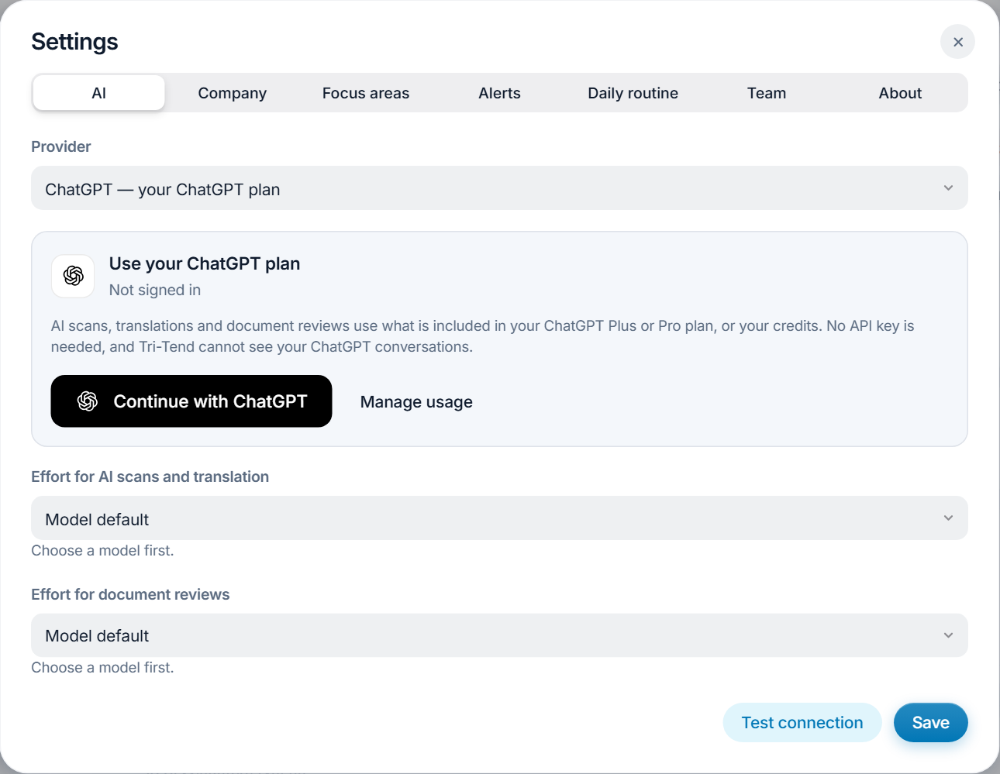
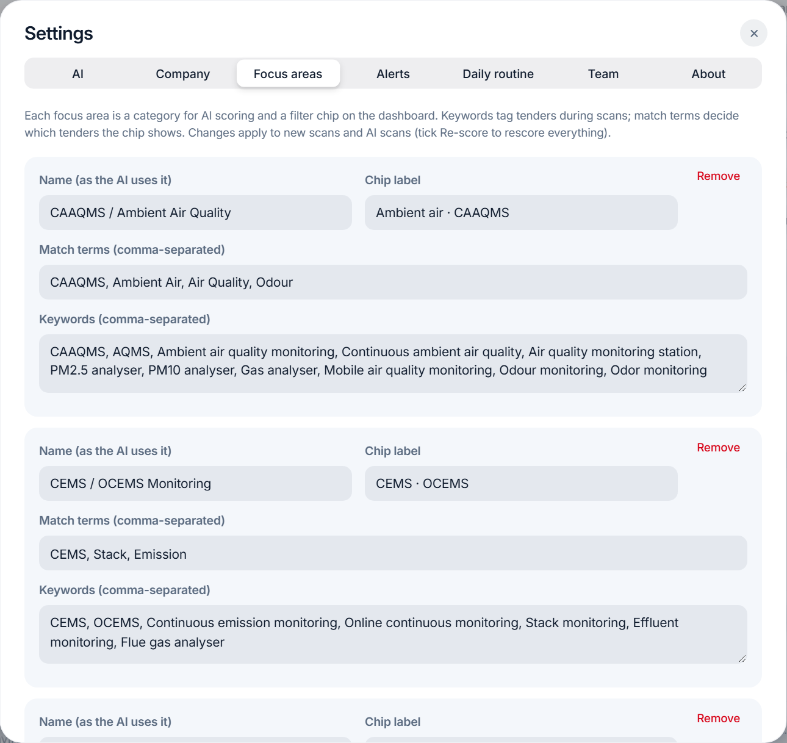
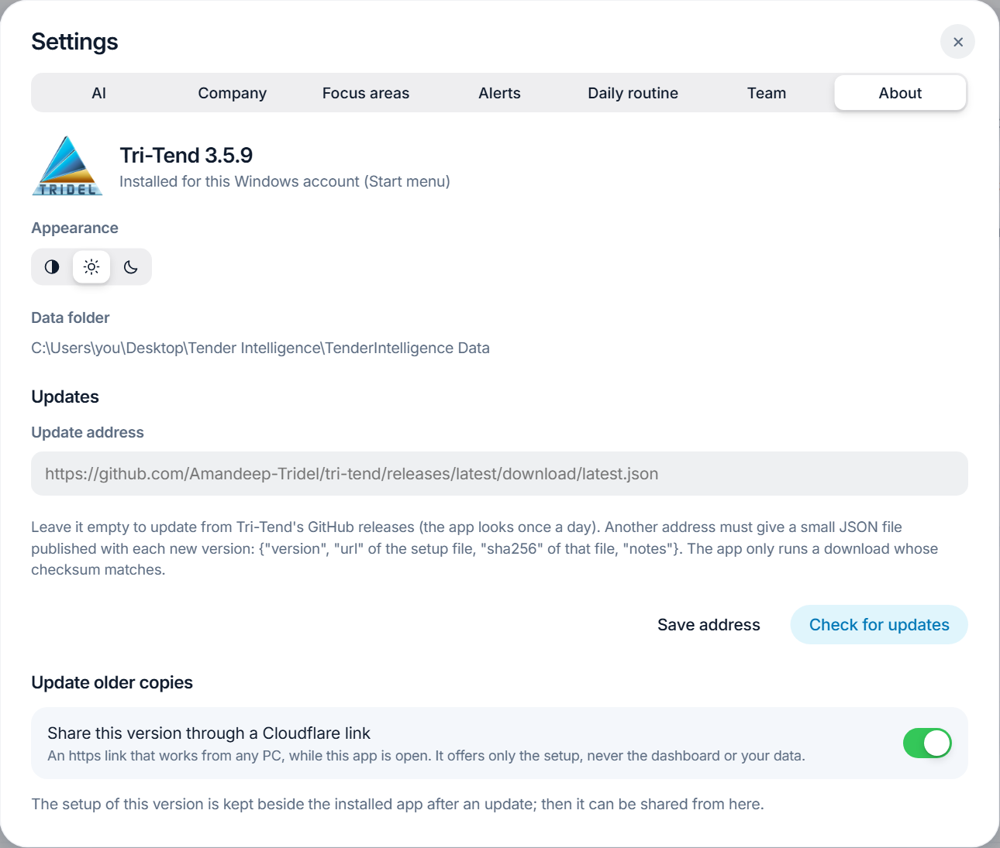

# Tri-Tend User Manual

Tri-Tend (Tender Intelligence) by Tridel Technologies · version 3.5.9 · [Download the latest version](https://github.com/Amandeep-Tridel/tri-tend/releases/latest) · [PDF version](Tri-Tend-User-Manual.pdf)

<!-- toc -->
## Contents

1. [Introduction](#1-introduction)
2. [Installing and updating](#2-installing-and-updating)
3. [The dashboard](#3-the-dashboard)
4. [Finding tenders](#4-finding-tenders)
5. [Scanning the portals](#5-scanning-the-portals)
6. [Scoring tenders with AI](#6-scoring-tenders-with-ai)
7. [Working on a tender](#7-working-on-a-tender)
8. [Tracking bids and deadlines](#8-tracking-bids-and-deadlines)
9. [Insights, map and documents](#9-insights-map-and-documents)
10. [Settings](#10-settings)
11. [Keyboard shortcuts](#11-keyboard-shortcuts)
12. [Questions and problems](#12-questions-and-problems)
<!-- /toc -->

## 1. Introduction

Tri-Tend finds public tenders that fit Tridel's business, scores them with AI and helps prepare the bids. It runs on a Windows PC and keeps all its data on that PC. This manual covers version 3.5.9.

What it does:

- **Finds tenders.** It reads India's public procurement portals: the Central and State eProcure portals (CPPP), GeM, the Andhra Pradesh, Telangana, Bihar and Gujarat portals, the public-sector companies' own portals (IndianOil, NTPC, Coal India, BHEL and others) and World Bank projects in India.
- **Scores them.** An AI gives every tender a score from 0 to 100 for how well it fits the company's focus areas, with a category and a one-line reason.
- **Reads the documents.** It downloads a tender's documents and has the AI review them: what is bought, eligibility against the company profile, and a bid or no-bid recommendation.
- **Tracks the bids.** A bid pipeline, a closing calendar, EMD and bank-guarantee records, reminders and a monthly report.

What you need:

- A Windows 10 or 11 PC with an internet connection.
- For AI scoring and reviews, one of: a ChatGPT Plus or Pro plan, a Claude Pro or Max plan, a Google AI Studio (Gemini) API key, or OmniRoute on the PC. Without any of them, Tri-Tend still works with its offline keyword rules.

## 2. Installing and updating

### 2.1 Installing

1. Download **TenderIntelligence-Setup.exe** from the [latest release](https://github.com/Amandeep-Tridel/tri-tend/releases/latest).
2. Run it. The setup is not code-signed yet, so Windows may say it is from an unknown publisher: choose **More info**, then **Run anyway**.
3. The app installs into a **Tender Intelligence** folder on the Desktop, with its data in **TenderIntelligence Data** inside it, and adds **Tender Intelligence** to the Start menu and the Desktop.

A new install starts with no tenders. Choose **Scan** (Section 5) to fill it, then **AI scan** (Section 6) to score what was found.

> **Note:** Only one copy of Tri-Tend can be open at a time. Opening it again brings the open window to the front.

### 2.2 Updates

Tri-Tend looks for a new version on GitHub once a day. When one is available it says so at the bottom of the window, with an **Install** button. The app closes, updates and opens again by itself. Tenders, scores, documents, the bid pipeline and settings all stay.

To look straight away, open **Settings → About** and choose **Check for updates**.

Copies older than 3.5.9 do not know about GitHub yet. Update them once by hand: close the app, then download and run the setup as in Section 2.1. Copies from 3.1.1 on can instead paste this address into **Settings → About → Update address** and choose **Check for updates**:

`https://github.com/Amandeep-Tridel/tri-tend/releases/latest/download/latest.json`

### 2.3 Removing the app

Use **Uninstall Tender Intelligence** in the Start menu, or Windows **Settings → Apps**. The data folder is kept unless you choose to remove it too.

## 3. The dashboard

The dashboard opens on what needs attention today.

*Figure 3.1 The dashboard*

- **The opening band** shows the number of opportunities and open tenders, the AI provider in use, and the four best tenders closing next (score 75 or more). Each number opens its list.
- **The five tiles** show the opportunities closing within 48 hours, the opportunities published this week, the high-priority ones, the value in play and the bids in progress. Click a tile to see its tenders.
- **The top bar** has the jump box (**Ctrl+K**: go to any tender, buyer, folder or page), **Scan**, **AI scan**, the bell, **Settings** (the sliders icon) and **Export**.
- **The bell** lists changes on tracked tenders, the daily routine's best new matches, company documents about to expire and deposits that are due.

The views along the top:

| View | What it shows |
| --- | --- |
| Opportunities | Open tenders in your focus areas that score 60 or more |
| All tenders | Every open tender from every portal |
| Closed | Tenders whose closing date has passed, kept for history |
| Pipeline | The tenders you track, by stage (Section 8) |
| Calendar | Tracked and high-priority tenders on the day they close |
| Insights | Charts, results and the monthly report (Section 9) |
| Documents | Every tender's documents and the company library |
| Map | Tenders by state |

## 4. Finding tenders

Below the opening band are the search, the filters and the list.

*Figure 4.1 Search, filters and the tender list*

- **Search** looks in the tender ID, title, buyer and keywords.
- **Category chips** show one focus area at a time.
- **Filters**: portal, closing date (48 hours to 30 days), state, value and publish date. **Reset** clears them all.
- **High priority only** keeps tenders scoring 75 or more.
- **Saved searches**: the bookmark icon saves the search, chips, filters and order under a name. The document icon searches inside every downloaded tender document.
- **Export** saves the current list, with its filters and order, as an Excel workbook or a CSV file.

In the list, each tender shows its score, category and portal, the buyer, the closing date with a countdown, its documents and its tracking stage. Click a tender to open its panel (Section 7). Right-click for quick actions, and click a column heading to sort by it.

Titles that contain one of your **words to exclude** (Section 10.3) are hidden. A line above the list says how many, with **Show them**.

## 5. Scanning the portals

**Scan** reads the portals for new tenders. It runs in the background, so you can keep working, and appears as a chip on the opening band while it runs.

*Figure 5.1 The scan panel*

1. Choose **Scan** in the top bar.
2. Tick the portals to read (all are ticked at first).
3. Choose the mode:
   - **Quick** reads the newest listings until it reaches tenders already saved. It usually takes a few minutes. Use it every day.
   - **Full rescan** re-reads every listing page to catch date changes on older tenders. It takes hours, because the portals serve about one page a second.
4. Choose **Start scan**. **Stop scan** ends it early; what was read so far is kept.

Tenders whose closing date has passed move to the **Closed** view. A portal's list is only replaced when it came back complete, and a backup is kept.

> **Note:** Some portals, such as Karnataka's and Chhattisgarh's, ask for a CAPTCHA before they list any tenders, so they cannot be scanned. The State eProcure portal is sometimes overloaded; if it fails, scan again later.

## 6. Scoring tenders with AI

**AI scan** gives each tender a score from 0 to 100, a category (one of your focus areas) and a one-line reason. Choose an AI provider in **Settings → AI** first (Section 10.1).

*Figure 6.1 The AI scan panel*

1. Choose **AI scan** in the top bar.
2. Choose which tenders to score:
   - **New tenders**: those with no score yet. Use this after each scan.
   - **Re-check opportunities**: score the current opportunities again with today's rules, so the ones that do not fit drop out.
   - **Re-score all**: every saved tender again. This takes the longest.
3. Choose **Start AI scan**.

How to read the scores:

| Score | Meaning |
| --- | --- |
| 75 to 100 | High priority: a close fit (the limit can be changed in Settings → Alerts) |
| 60 to 74 | An opportunity: shown in the Opportunities view |
| Below 60 | Not a fit, such as maintenance contracts (AMC), repairs, civil works and generic goods |

- Only the title, buyer and reference of each tender are sent to the AI provider, about 100 tenders per request.
- Progress is saved as it goes, so a stopped scan continues where it stopped.
- **Translate to English** gives English titles to tenders published in an Indian language.

## 7. Working on a tender

Click any tender to open its panel beside the list. **J** and **K** move to the next and previous tender, and **Esc** closes the panel.

*Figure 7.1 A tender's panel*

At the top are the score, category, portal and time left, then three buttons:

- **Inspect** reads the tender's full details from the portal (value, EMD, fee, inviting authority) and downloads its documents. Some portals show a CAPTCHA: type the characters you see.
- **Open on portal** opens the tender on the official portal in your browser.
- **Copy ID** copies the tender ID.

The tabs:

| Tab | What it holds |
| --- | --- |
| Overview | The timeline, why it scores what it does, the listing and the inspected details |
| Documents | The tender's documents and your own files for it; click one to preview it |
| Review | The AI's review of the documents: a summary, a recommendation (Bid, Bid with a partner, Do not bid or Needs review), eligibility against the company profile (Meets, Gap or Unclear), points to verify and next steps, with the passages it relied on |
| Bid | A bid/no-bid scorecard, eligibility and company documents, EMD, fees and guarantees, a bid pack (one PDF with a contents page, and a ZIP), ready-made Word letters, and the result after opening |
| Tracking | The tender's stage, owner, your own deadline and notes |
| History | What changed on the portal: corrigenda, new dates and new documents |

To review several tenders at once, tick them in the list and choose **Download & analyze selected**. It inspects and reviews up to 50 tenders in one run; **Download reports** saves the results.

> **Note:** A review sends the documents' text to your AI provider. Large documents are reviewed in parts and combined into one report.

## 8. Tracking bids and deadlines

Track a tender from the **Track** column or its **Tracking** tab. Each tracked tender has a stage:

| Stage | Use it when |
| --- | --- |
| Watching | You are considering it |
| Preparing | The bid is being prepared |
| Submitted | The bid has been submitted |
| Won / Lost | The result is known |
| Not bidding | You decided not to bid |

- **Pipeline** shows the tracked tenders as cards by stage, with value, EMD and scorecard. Below it, a table lists every EMD, fee and bank guarantee with its status.
- **Calendar** shows tracked tenders and those scoring 75 or more on the day they close.
- **Alerts** and the **daily routine** (Sections 10.4 and 10.5) remind you of closing dates and changes.

> **Important:** Always confirm deadlines and requirements on the official portal before you submit.

## 9. Insights, map and documents

**Insights** shows the relevant open tenders by focus area, the top buyers, new relevant tenders per week, the opportunities by portal, and your results after opening (win rate, ranks and winners). The **Monthly report** gives management a printable page or an Excel workbook for any month.

*Figure 9.1 Insights*

**Map** shows the tenders by state, for the opportunities or for all tenders. The list's filters apply here too. Click a state to list its tenders. The states you serve are outlined (Section 10.3).

*Figure 9.2 Tenders by state*

**Documents** has a folder for each tender and a **company library** for your own certificates and records. You can:

- add files by dragging them in (PDF, Word, Excel, CSV, ZIP, images and text, up to 50 MB each);
- give each file a category and, for certificates, an expiry date (the bell warns before it expires);
- search inside every document;
- review a tender's documents from here, as in its Review tab.

## 10. Settings

Open **Settings** with the sliders icon in the top bar.

### 10.1 AI

Choose the AI provider, the model for AI scans, and the model for document reviews.

*Figure 10.1 Settings → AI*

| Provider | What you need | How to set it up |
| --- | --- | --- |
| ChatGPT | A ChatGPT Plus or Pro plan | Choose **Continue with ChatGPT** and sign in in the browser |
| Claude | A Claude Pro or Max plan | Choose **Sign in to Claude**. Claude Code installs itself in the background the first time. If the browser shows a code, paste it into the app |
| Google AI Studio | A Gemini API key | Paste the key, then **Load models** |
| OmniRoute | OmniRoute running on this PC | Choose **Load models**. Avoid models marked ⚠: they go through a subscription sign-in that its company does not allow other apps to use |
| Local Ollama | Ollama on this PC | Check the address, then **Load models** |
| Custom gateway | An OpenAI-compatible address and key | Enter both, then **Load models** |
| Offline keyword rules | Nothing | No AI: tenders are matched by keywords only |

- **Model for AI scans** sends many short requests: choose a quick model. **Model for document reviews** sends one long request per tender: choose the strongest model.
- **Effort** sets how long the model thinks. Low effort suits AI scans; high effort suits reviews.
- **Test connection** checks the provider before you save. **Remember keys on this PC** keeps API keys, encrypted for your Windows account; otherwise they are forgotten when the app closes.

Plans have usage limits that renew over time. **Manage usage** opens the provider's own usage page.

> **Note:** Gemini through Google's Antigravity is turned off: Google's terms do not allow other apps to use it. Use the Gemini API key instead.

### 10.2 Company

The company profile tells the AI what Tridel offers, where it works, its turnover, experience, certifications, past projects and what it is not interested in. AI scores and document reviews use it, so the more specific it is, the better the results. The fields under **For letters and forms** fill in the letters made from a tender's Bid tab.

### 10.3 Focus areas

Each focus area is a category for AI scoring and a chip on the dashboard.

*Figure 10.2 Settings → Focus areas*

- **Name**: the category the AI uses. **Chip label**: the short name on the dashboard.
- **Keywords** tag tenders during scans; **match terms** decide which tenders the chip shows.
- **Words to exclude** hide tenders whose title contains them (for example AMC, housekeeping, manpower supply).
- **States you serve** are outlined on the map. None ticked means all of India.

After changing focus areas, run an AI scan with **Re-score all** so every tender is scored against them.

### 10.4 Alerts

After each daily routine, a digest lists new high-priority tenders, tracked tenders closing soon and changes on tracked tenders. It can arrive as a Windows notification, by email (through your SMTP server) or on Telegram. Set what counts as high priority and how many days before closing to remind you, then choose **Send a test**. Passwords and tokens are stored encrypted for your Windows account.

### 10.5 Daily routine

Every day at the set time, the routine runs a quick scan, scores the new tenders, checks tracked tenders for corrigenda and date changes, and sends the digest. Its best new matches are suggested for a document review. Turn on **Also when the app is closed** to let Windows run it in the background. **Run now** runs it straight away, and **Recent runs** lists what each run found.

### 10.6 Team

**Share with my team on this network** lets colleagues in the office open the dashboard in their browser. They sign in with the access code you set, and can browse, track bids, add notes and inspect tenders, but cannot change settings, keys or scans. This PC must stay on while they use it, and Windows may ask once to allow the app through its firewall. Use an access code you do not use anywhere else.

### 10.7 About

*Figure 10.3 Settings → About*

- The version, and whether this copy is installed or portable.
- **Appearance**: match Windows, light or dark.
- **Data folder**: where the tenders, scores, documents and settings are kept.
- **Updates**: leave the address empty to update from GitHub (Section 2.2). **Check for updates** looks straight away.
- **Update older copies**: a temporary Cloudflare link from which older copies on other PCs can download this version. It works while the app is open and changes each time the app starts.

## 11. Keyboard shortcuts

Press **?** in the app to see this list.

| Keys | Action |
| --- | --- |
| Ctrl + K | Jump to a tender, buyer, folder or page |
| / | Search the tender list |
| 1 to 8 | Opportunities, All tenders, Closed, Pipeline, Calendar, Insights, Documents, Map |
| J and K, or ↓ and ↑ | Next and previous tender |
| Enter or O | Open the tender's panel |
| I · D · T | Inspect it · its documents · its tracking |
| N and P | Next and previous page |
| Alt + ← and Alt + → | Back and forward (the mouse's side buttons too) |
| Esc | Close the open window or panel |

## 12. Questions and problems

**A scan is slow, or a portal failed.** The State eProcure portal is often busy. A quick scan keeps the old tenders when a portal fails. Scan again at a quieter time.

**The AI scan seems stuck at 0.** The first answers can take a minute or two. The progress line shows how many answers it is waiting for.

**The AI says it is not signed in, or the plan limit is reached.** Open **Settings → AI** and sign in again, or wait for the plan's limit to renew (ChatGPT Plus renews every five hours), or choose another model.

**Inspect asks for a CAPTCHA.** Some portals ask for one before showing a tender's details or documents. Type the characters shown.

**Windows warns about an unknown publisher.** The setup is not code-signed yet. Choose **More info**, then **Run anyway**.

**Where is my data?** In the data folder shown in **Settings → About**. Updates never remove it. Keys, passwords and tokens are encrypted for your Windows account.

**Who can see my tenders?** Nobody outside this PC, unless you turn on team sharing. The update link and the GitHub releases carry only the app, never your data.
